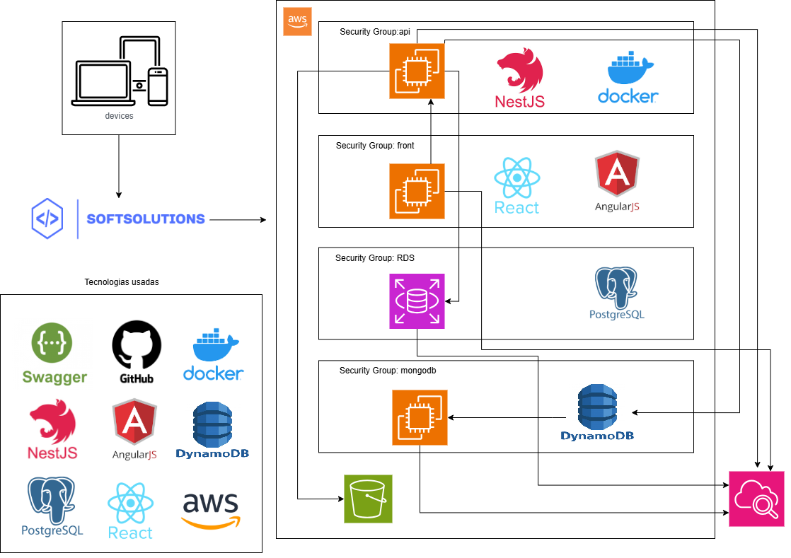

# 🧠 API SoftSolutions

> Backend utilizando NestJS com Clean Architecture e TypeORM.

## 🗂️ Modelo DER


## 📚 Documentação

- [📘 Swagger API Docs](http://localhost:4000/api) – Documentação interativa da API
- [🚀 API em Produção](https://api-softsolutions.onrender.com) — Endpoint público da API
- [🌐 Frontend em Produção](https://solutionssoft.vercel.app) — Interface web conectada à API


### ⚙️ Pré-requisitos.

- **Node.js** >= 18.x
- **Docker** >= 20.x
- **Docker Compose** >= 2.x

## Como Executar


### 💻 Execução local

1. **Clone o repositório**
   ```bash
   git clone https://github.com/SoftSolutionsProject/api-softsolutions
   cd api-softsolutions-develop
   ```

2. **Instale as dependências**
   ```bash
   npm install
   ```

3. **Configure o ambiente**
   ```bash
   cp .env.example .env
   # Edite com as variáveis locais de banco e porta
   # Windows (CMD): copy .env.example .env
   ```

4. **Execute as migrações**
   ```bash
   npm run migration:run
   ```

5. **Execute os seeders para popular o banco:**
 ```bash
   npm run seed
   ```

6. **Inicie o servidor**
   ```bash
   npm run start:dev
   ```


## 📜 Scripts Disponíveis

```bash
# Desenvolvimento
npm run start:dev         # Iniciar em modo desenvolvimento (watch)
npm run start:debug       # Iniciar em modo debug (watch)
npm run start             # Iniciar aplicação
npm run build             # Compilar aplicação
npm run start:prod        # Executar versão compilada

# Banco de Dados (TypeORM)
npm run typeorm           # Executar CLI do TypeORM
npm run migration:generate # Gerar nova migração
npm run migration:new     # Gerar nova migração com nome (use: npm run migration:new --name=nome)
npm run migration:run     # Executar migrações pendentes
npm run migration:run:prod # Executar migrações em produção

# Seeders
npm run seed              # Executar seeders (popula dados iniciais)

# ✅ Testes
npm run test              # Executar testes unitários
npm run test:watch        # Executar testes em modo watch
npm run test:cov          # Verificar cobertura de testes
npm run test:debug        # Debug de testes unitários
npm run test:e2e          # Testes end-to-end

# Lint e Format
npm run lint              # Verificar problemas de lint e corrigir
npm run format            # Formatar código com Prettier
```


## 🧰 Tecnologias Utilizadas

- **Framework**: [NestJS](https://nestjs.com)
- **Linguagem**: TypeScript
- **Banco de Dados**: PostgreSQL
- **ORM**: TypeORM
- **Autenticação**: JWT
- **Validação**: class-validator
- **Documentação**: Swagger/OpenAPI
- **Containerização**: Docker & Docker Compose
- **Testes**: Jest
- **Arquitetura**: Clean Architecture
- **CI/CD**: GitHub Actions


## 📂 Estrutura do Projeto

```bash
src/
├── main.ts               # Ponto de entrada da aplicação
├── app.module.ts         # Módulo raiz do NestJS
├── application/          # Casos de uso e regras de negócio
├── domain/               # Entidades, enums e interfaces 
├── infra/                # Implementações de repositórios, controllers, banco, serviços externos
│   ├── controllers/      # Controllers HTTP
│   ├── database/         # Configuração e entidades do banco de dados
│   ├── repositories/     # Implementações dos repositórios
│   └── ...               # Outros módulos de infraestrutura
└── config/               # Configurações globais do projeto 

```

## ☁️ Deploy AWS – Infraestrutura

### Arquitetura / Fluxograma


### 🌐 Endpoints em Produção (AWS EC2)

- **Backend (NestJS + Nginx + Docker)**
  - http://ec2-54-164-244-60.compute-1.amazonaws.com

- **Frontend (Angular + Nginx + Docker)**
  - http://ec2-3-212-230-198.compute-1.amazonaws.com

> ⚠️ **Observação:** A infraestrutura AWS utilizada neste projeto está hospedada em um ambiente de laboratório acadêmico. Por isso, as instâncias podem ser desligadas periodicamente e os endpoints podem não estar sempre disponíveis.


## Equipe

| Função          | Membro                   |  Conecte-se                  |
|-----------------|--------------------------|----------------------------------------------------------------------------------------------------------------------|
|  Desenvolvedor  | Caio Henrique Rodrigues  | [](https://github.com/CaioRodrigues12)              |
|  Desenvolvedor  | Évellin de Lima Jacinto  | [](https://github.com/evllinlima)  |
|  Desenvolvedor  | Lucas Salvador Notaro    | [](https://github.com/LucasNotaro)     |
|  Desenvolvedor  | Lucas Santo Gomes        | [](https://github.com/lucassantosgomes02) |
|  Desenvolvedor  | Rafael da Costa Castro   | [](https://github.com/RafaelCostaCastro)        |
