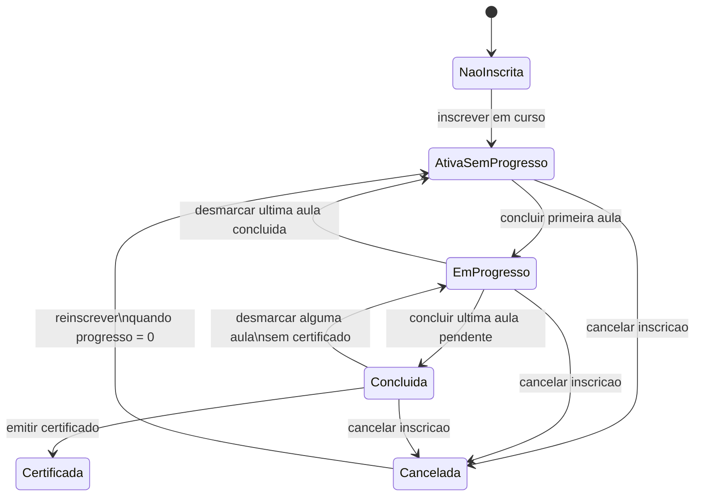

# Diagrama UML de Estados e Casos de Teste - Inscricao

## Caso escolhido

Caso analisado: **ciclo de vida da inscrição (`Inscricao`) no fluxo de uso do aluno**.

Neste documento, os estados da inscrição foram definidos pelo **comportamento do processo**, e não apenas pelo campo `status` salvo no banco.

## Base no código

- `src/application/use-cases/inscricao/inscrever-usuario.use-case.ts`
- `src/application/use-cases/inscricao/cancelar-inscricao.use-case.ts`
- `src/application/use-cases/inscricao/ver-progresso.use-case.ts`
- `src/application/use-cases/inscricao/marcar-aula-concluida.use-case.ts`
- `src/application/use-cases/inscricao/desmarcar-aula-concluida.use-case.ts`
- `src/application/use-cases/certificado/emitir-certificado.use-case.ts`

## Observação importante

O modelo `Inscricao` declara `status: 'ativo' | 'concluido' | 'cancelado'`, mas o estado de negócio **Concluída** não é persistido explicitamente no código atual.

Para este exercício, a interpretação adotada foi:

- `Ativa sem progresso`: inscrição ativa com 0% de progresso;
- `Em progresso`: inscrição ativa com progresso maior que 0% e menor que 100%;
- `Concluída`: inscrição com 100% das aulas concluídas e ainda sem certificado;
- `Certificada`: inscrição para a qual já existe certificado emitido;
- `Cancelada`: inscrição com `status = cancelado`.

## Estados identificados

### 1. `Nao inscrita`

O usuário ainda não possui inscrição no curso.

### 2. `Ativa sem progresso`

O usuário está inscrito e os progressos das aulas foram criados, mas nenhuma aula foi concluída.

Critérios observáveis:

- `status = ativo`
- `aulasConcluidas = 0`

### 3. `Em progresso`

A inscrição está ativa e o aluno já concluiu parte do curso.

Critérios observáveis:

- `status = ativo`
- `aulasConcluidas > 0`
- `aulasConcluidas < totalAulas`

### 4. `Concluida`

Todas as aulas da inscrição foram concluídas, mas o certificado ainda não foi emitido.

Critérios observáveis:

- `status = ativo`
- `aulasConcluidas = totalAulas`
- ainda não existe certificado

### 5. `Certificada`

A inscrição já atingiu a conclusão e já possui certificado emitido.

Critérios observáveis:

- existe certificado para a inscrição
- não é mais permitido desmarcar aula concluída

### 6. `Cancelada`

A inscrição foi cancelada pelo usuário ou administrador.

Critérios observáveis:

- `status = cancelado`

## Diagrama UML de Estados

## Transições consideradas

| ID | Transição | Evento | Regra |
|---|---|---|---|
| T1 | `Nao inscrita` -> `Ativa sem progresso` | inscrever em curso | cria a inscrição ativa e cria progressos pendentes para as aulas |
| T2 | `Ativa sem progresso` -> `Em progresso` | concluir primeira aula | o progresso sai de 0% para valor maior que 0% |
| T3 | `Em progresso` -> `Ativa sem progresso` | desmarcar última aula concluída | o progresso volta para 0% |
| T4 | `Em progresso` -> `Concluida` | concluir última aula pendente | o progresso chega a 100% |
| T5 | `Concluida` -> `Em progresso` | desmarcar alguma aula | permitido apenas se ainda não houver certificado |
| T6 | `Concluida` -> `Certificada` | emitir certificado | permitido apenas com 100% das aulas concluídas |
| T7 | `Ativa sem progresso` -> `Cancelada` | cancelar inscrição | grava `status = cancelado` |
| T8 | `Em progresso` -> `Cancelada` | cancelar inscrição | grava `status = cancelado` |
| T9 | `Concluida` -> `Cancelada` | cancelar inscrição | o caso de uso atual permite cancelamento, mesmo com 100% concluído |
| T10 | `Cancelada` -> `Ativa sem progresso` | reinscrever no curso | inscrição cancelada é reativada com `status = ativo` |

## Casos de teste

### a) Cobertura de estados

| ID | Estado coberto | Pré-condições | Ação | Resultado esperado |
|---|---|---|---|---|
| E1 | `Nao inscrita` | usuário sem inscrição no curso | consultar cenário inicial | não existe registro de inscrição para o curso |
| E2 | `Ativa sem progresso` | usuário e curso válidos | inscrever usuário no curso | inscrição ativa criada e progresso inicial em 0% |
| E3 | `Em progresso` | inscrição ativa com pelo menos uma aula concluída e outra pendente | consultar progresso | progresso entre 0% e 100% |
| E4 | `Concluida` | todas as aulas concluídas e nenhum certificado emitido | consultar progresso e certificado | progresso em 100% e inscrição ainda sem certificado |
| E5 | `Certificada` | inscrição com certificado emitido | tentar desmarcar aula | sistema rejeita a operação |
| E6 | `Cancelada` | inscrição existente | cancelar inscrição | `status` atualizado para `cancelado` |

### b) Cobertura de transição

| ID | Transição coberta | Pré-condições | Ação | Resultado esperado |
|---|---|---|---|---|
| TT1 | T1 `Nao inscrita` -> `Ativa sem progresso` | usuário sem inscrição prévia | inscrever em curso | inscrição criada com status ativo e aulas pendentes |
| TT2 | T2 `Ativa sem progresso` -> `Em progresso` | inscrição ativa, nenhuma aula concluída | concluir uma aula | progresso passa a ser maior que 0% |
| TT3 | T3 `Em progresso` -> `Ativa sem progresso` | apenas uma aula concluída | desmarcar essa aula | progresso retorna a 0% |
| TT4 | T4 `Em progresso` -> `Concluida` | falta apenas uma aula para terminar | concluir última aula | progresso chega a 100% |
| TT5 | T5 `Concluida` -> `Em progresso` | 100% concluído e sem certificado | desmarcar uma aula | progresso deixa de ser 100% |
| TT6 | T6 `Concluida` -> `Certificada` | 100% concluído e sem certificado | emitir certificado | certificado criado com sucesso |
| TT7 | T7 `Ativa sem progresso` -> `Cancelada` | inscrição ativa e sem progresso | cancelar inscrição | status passa para cancelado |
| TT8 | T8 `Em progresso` -> `Cancelada` | inscrição ativa com progresso parcial | cancelar inscrição | status passa para cancelado |
| TT9 | T9 `Concluida` -> `Cancelada` | inscrição concluída, sem certificado | cancelar inscrição | status passa para cancelado |
| TT10 | T10 `Cancelada` -> `Ativa sem progresso` | inscrição cancelada sem progresso concluído | reinscrever no curso | status volta para ativo |

### c) Cobertura de caminhos

| ID | Caminho | Objetivo | Resultado esperado |
|---|---|---|---|
| P1 | `Nao inscrita` -> `Ativa sem progresso` | validar entrada no fluxo | inscrição criada corretamente |
| P2 | `Nao inscrita` -> `Ativa sem progresso` -> `Em progresso` | validar início do aprendizado | progresso parcial calculado corretamente |
| P3 | `Nao inscrita` -> `Ativa sem progresso` -> `Em progresso` -> `Concluida` | validar término do curso | progresso chega a 100% |
| P4 | `Nao inscrita` -> `Ativa sem progresso` -> `Em progresso` -> `Concluida` -> `Certificada` | validar encerramento com certificado | certificado emitido apenas após conclusão total |
| P5 | `Nao inscrita` -> `Ativa sem progresso` -> `Cancelada` -> `Ativa sem progresso` | validar cancelamento e reinscrição | inscrição reativada com status ativo |
| P6 | `Nao inscrita` -> `Ativa sem progresso` -> `Em progresso` -> `Concluida` -> `Em progresso` | validar retorno antes da certificação | progresso pode retroceder se aula for desmarcada antes do certificado |

## Detalhamento dos testes sugeridos

### CT-01: criar inscrição ativa sem progresso

- **Tipo**: cobertura de estado e transição
- **Estados/Transições**: `Ativa sem progresso`, T1, P1
- **Dado** um usuário sem inscrição no curso
- **Quando** ele se inscrever no curso
- **Então** o sistema deve criar a inscrição com `status = ativo`
- **E** deve criar os progressos das aulas com 0% concluído

### CT-02: mover a inscrição para em progresso

- **Tipo**: cobertura de estado, transição e caminho
- **Estados/Transições**: `Em progresso`, T2, P2
- **Dado** uma inscrição ativa sem progresso
- **Quando** o aluno concluir a primeira aula
- **Então** a inscrição deve ser interpretada como em progresso

### CT-03: voltar de em progresso para ativa sem progresso

- **Tipo**: cobertura de transição
- **Estados/Transições**: T3
- **Dado** uma inscrição com exatamente uma aula concluída
- **Quando** o aluno desmarcar essa aula
- **Então** o progresso deve voltar para 0%
- **E** a inscrição retorna ao estado ativa sem progresso

### CT-04: atingir a conclusão do curso

- **Tipo**: cobertura de estado, transição e caminho
- **Estados/Transições**: `Concluida`, T4, P3
- **Dado** uma inscrição com todas as aulas concluídas, exceto a última
- **Quando** o aluno concluir a última aula pendente
- **Então** o progresso deve atingir 100%
- **E** a inscrição deve ser interpretada como concluída

### CT-05: sair de concluída para em progresso

- **Tipo**: cobertura de transição e caminho
- **Estados/Transições**: T5, P6
- **Dado** uma inscrição com 100% das aulas concluídas
- **E** sem certificado emitido
- **Quando** o aluno desmarcar uma aula concluída
- **Então** o progresso deve ficar abaixo de 100%
- **E** a inscrição volta para em progresso

### CT-06: emitir certificado

- **Tipo**: cobertura de estado, transição e caminho
- **Estados/Transições**: `Certificada`, T6, P4
- **Dado** uma inscrição com 100% das aulas concluídas
- **E** sem certificado existente
- **Quando** o aluno solicitar o certificado
- **Então** o sistema deve emitir o certificado
- **E** a inscrição passa a ser interpretada como certificada

### CT-07: cancelar inscrição ativa

- **Tipo**: cobertura de estado e transição
- **Estados/Transições**: `Cancelada`, T7
- **Dado** uma inscrição ativa sem progresso
- **Quando** o usuário cancelar a inscrição
- **Então** o status deve mudar para `cancelado`

### CT-08: cancelar inscrição em progresso

- **Tipo**: cobertura de transição
- **Estados/Transições**: T8
- **Dado** uma inscrição com progresso parcial
- **Quando** o usuário cancelar a inscrição
- **Então** o status deve mudar para `cancelado`

### CT-09: cancelar inscrição concluída

- **Tipo**: cobertura de transição
- **Estados/Transições**: T9
- **Dado** uma inscrição com 100% de progresso e sem certificado
- **Quando** o usuário cancelar a inscrição
- **Então** o caso de uso atual deve permitir o cancelamento

### CT-10: reinscrever após cancelamento

- **Tipo**: cobertura de transição e caminho
- **Estados/Transições**: T10, P5
- **Dado** uma inscrição cancelada sem progresso concluído
- **Quando** o usuário se inscrever novamente no mesmo curso
- **Então** o sistema deve reativar a inscrição
- **E** o status deve voltar para `ativo`

## Conclusão

O caso `Inscricao` pode ser modelado com mais de três estados quando o foco é o fluxo de uso do aluno. Mesmo que nem todos esses estados apareçam como `status` persistido, eles são observáveis pela combinação entre:

- situação da inscrição;
- percentual de progresso no curso;
- existência ou não de certificado.
